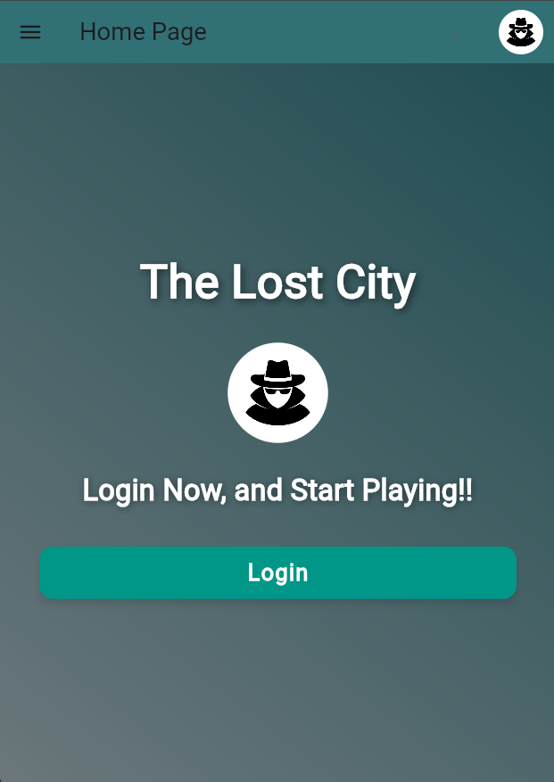
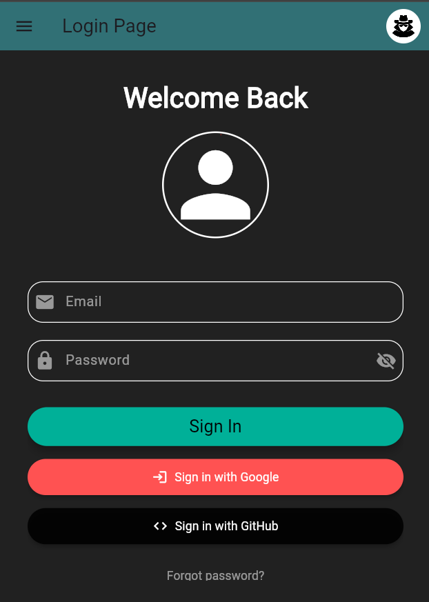
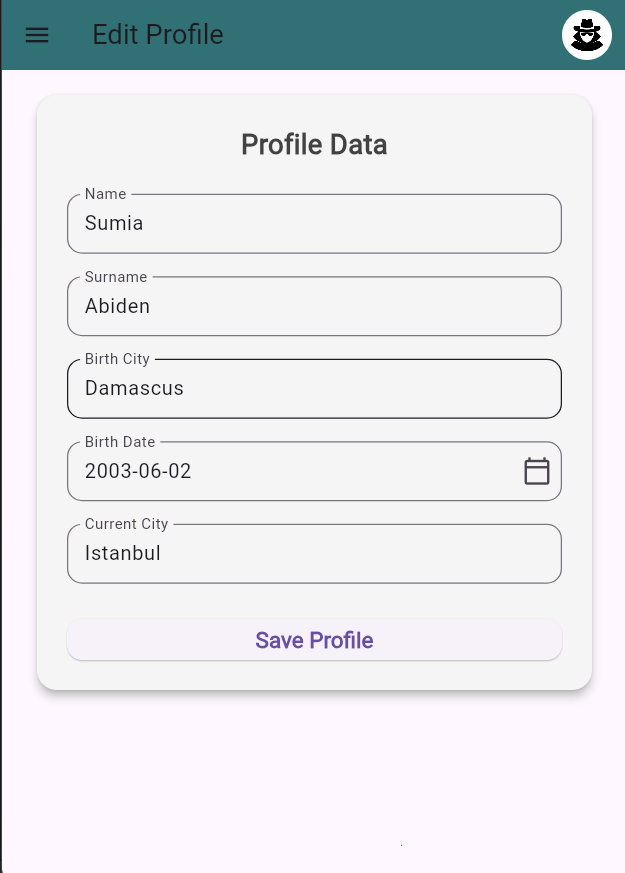
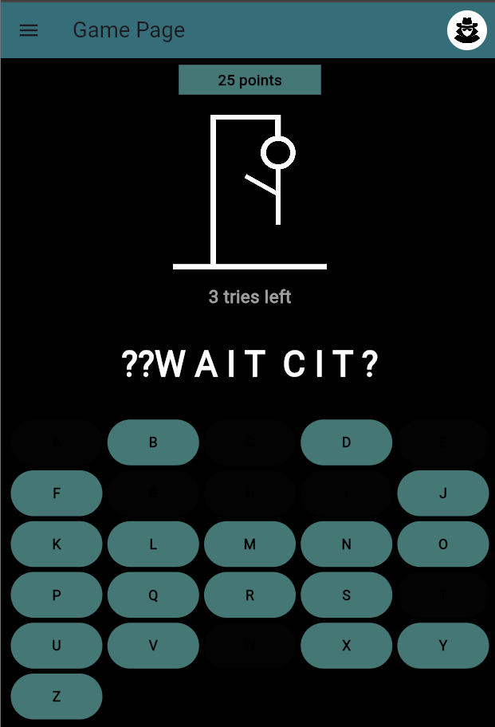
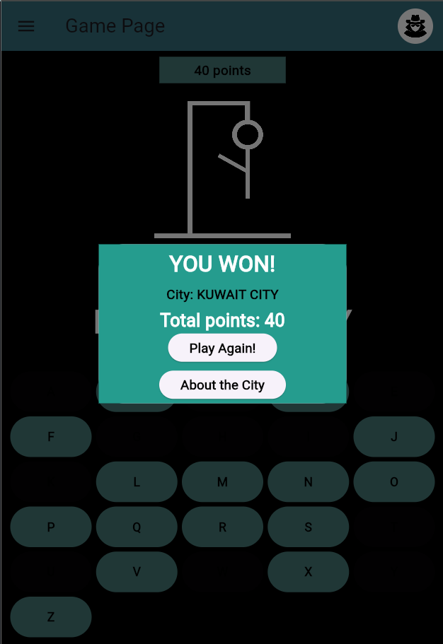
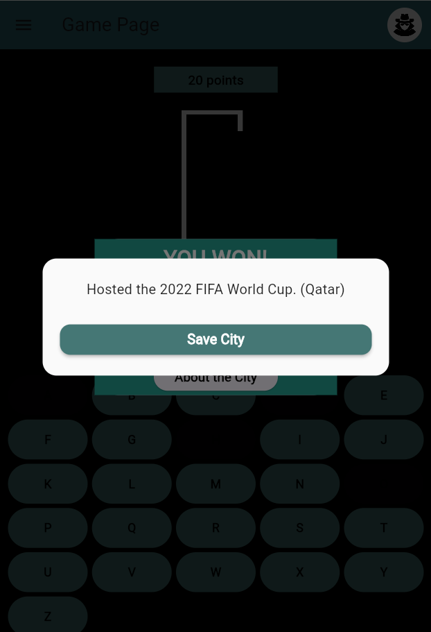
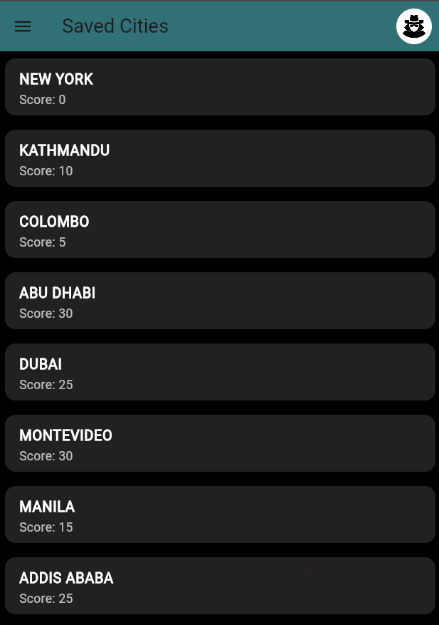

# The Lost City

**The Lost City**, Flutter ile geliştirilmiş, interaktif ve eğitici bir şehir tahmin oyunudur. Kullanıcılar Dünya şehirlerini harf harf tahmin ederek oyunu tamamlamaya çalışır, aynı zamanda tahmin edilen şehirlerle ilgili kullanıcıya genel bir bilgi sunar, kullanıcının kaydettiği şehirleri Supabase tabanlı veritabanında skorlarıyla beraber kaydeder. Firebase Authentication ile güvenli kullanıcı girişi sağlanır. Temiz UI/UX, karanlık mod ve ses efektleri ile zengin bir oyun deneyimi sunar.

---

## Proje Amacı

Bu proje, oyunlaştırılmış bir şehir öğrenme deneyimi sunarak kullanıcıların Dünyadaki farklı şehirleri tanımasına olanak sağlar. Kullanıcılar, şehirleri tahmin ederken coğrafi ve kültürel farkındalık kazanır. Ayrıca kullanıcılar oyun skorlarını kaydederek ilerlemelerini takip edebilir, tercih ettikleri tema ve ses ayarları ile oyun deneyimlerini kişiselleştirebilirler.

---

## Teknoloji ve Araçlar

- **Flutter**: Tüm uygulama Flutter SDK ile geliştirilmiştir.
- **Firebase Authentication**: Kullanıcı kimlik doğrulaması için kullanılır (email/şifre).
- **Supabase**: Oyun verileri ve kullanıcıya özel skorların saklanması için backend olarak PostgreSQL veritabanı sağlar.
- **Provider**: Uygulama genelinde durum yönetimi (state management) için tercih edilmiştir.
- **SharedPreferences**: Kullanıcı ayarlarının kalıcı saklanması için kullanılmıştır.
- **audioplayers kütüphanesi**: Oyun içi ses efektlerini oynatmak için.

---

## Test Kullanıcı Bilgileri

Projeyi kolayca test etmek için önceden oluşturulmuş bir test kullanıcı bulunmaktadır:

| Email                | Şifre        |
|----------------------|--------------|
| testuser@example.com | Test1234     |

Bu kullanıcıyla giriş yaparak uygulamanın tüm özelliklerini deneyebilirsiniz.

---

## Mimari ve Katmanlar

- **UI Katmanı:**
    - `BasePage`: Ortak sayfa yapısı ve temalar için temel widget.
    - Ekranlar (LoginPage, SettingsPage, SavedWordsPage, GamePage, ProfilePage, EditProfilePage vb.)
- **State Management:**
    - Provider ile tema, ses durumu, kullanıcı durumu gibi global değişkenler yönetilir.
- **Backend İletişimi:**
    - Firebase Authentication: Kimlik doğrulama ve kullanıcı yönetimi.
    - Supabase: REST API üzerinden kullanıcıya özel verilerin CRUD işlemleri.

---

## Temel Uygulama Sayfaları ve Görevleri

### 1. Giriş Ekranı - `LoginPage`
- Kullanıcı, e-posta & şifre, Google ve Github ile giriş yapabilir.
- Firebase Authentication üzerinden kimlik doğrulama sağlanır.
- Başarılı giriş sonrası `HomePage`'e yönlendirme yapılır.
- "Şifremi Unuttum" bağlantısı sayesinde daha önce giriş yapan kullanıcı için şifre sıfırlama maili iletilir.

### 2. Profil Düzenle Sayfası - `EditProfilePage`
- Kullanıcı, profil bilgilerini ekleyip güncelleyebilir.
- Değişiklikler Firebase Firestore ve Supabase üzerinde senkronize edilir.
- SharedPreferences ile yerel cihazda veriler saklanır.

### 3. Profil Sayfası - `ProfilePage`
- Kullanıcının doğum yeri, doğum tarihi ve yaşadığı şehir gibi bilgileri gösterir.
- Firebase ve Supabase'den veriler çekilerek ekrana yansıtılır.
- Kullanıcı e-postası da bu sayfada yer alır.
- 
### 4. Ana Sayfa - `HomePage`
- Oyun başlatma, profil görüntüleme, skor ve ayarlara erişim sağlar.
- Modern ve sade bir arayüz sunar.

### 5. Oyun Ekranı - `GamePage`
- Şehir tahmin oyununun oynandığı ekrandır.
- Harf tahminleri yapılır, seçilen harf ekrandan silinir.
- Şehir tahmini için verilen deneme haklarından sonra kullanıcıya aldığı puan ve doğru şehir adı gösterilir.
- Kullanıcının isteği üzerine şehir ile ilgili genel kültür ve bulunduğu ülke bilgisi verilir.
- Skor hesaplama, ses efektleri, oyun bitiş pencereleri bulunur.

### 6. Kayıtlı Şehirler - `SavedWords`
- Giriş yapan mail adresine göre kullanıcının daha önce kaydettiği şehirler supabase veritabanından çekilir.
- Şehir ismi ve kullanıcı skorunu içerir.
- Kullanıcının hesaptan çıkış yapması durumunda kaydedilen şehirler silinir.

### 7. Ayarlar Ekranı - `SettingsPage`
- Uygulama teması (karanlık/açık mod) ve ses efektleri yönetilebilir.
- "Hakkında" bölümü üzerinden uygulama bilgileri görüntülenebilir.


> ⚙️ Tüm sayfalarda `BasePage` bileşeni kullanılarak ortak bir yapı (AppBar + gövde) korunmuştur. Tema ve ayarlar Provider ile yönetilmiştir.

---

## Firebase Authentication Kullanımı

- Kullanıcılar uygulamaya email ve şifre ile kayıt olur ve giriş yapar.
- Firebase SDK oturum yönetimini sağlar.
- Kullanıcı oturumu açıkken uygulama Supabase sorgularını kullanıcı email’i ile yapar.
- Şifre sıfırlama maili Firebase üzerinden gönderilir.

---

## Tema ve Ses Yönetimi

- `SettingsProvider.dart` ile tema ve ses durumu yönetilir.
- Kullanıcı tercihi uygulama genelinde anında uygulanır ve UI buna göre güncellenir.
- Temalar: Karanlık ve açık tema tanımlanmıştır.
- Ses efektleri doğru/yanlış harf tahminlerinde tetiklenir.

---

## Grup Üye Katkıları

| Üye Adı               | Katkı Alanları                                                                                                                                                                                                                                                  |
|-----------------------|-----------------------------------------------------------------------------------------------------------------------------------------------------------------------------------------------------------------------------------------------------------------|
| **Sumia Abiden**      | - Uygulama genel UI/UX tasarımı (Login.dart & Game.dart & SavedWords.dart & AppDrawer.dart & CustomAppBar.dart) <br> - Supabase veritabanı kurulumu ve veri okuma/yazma işlemleri <br> - SharedPreferences ile verilerin yerel olarak saklanması (settings_provider.dart & profile_provider.dart) <br> - Skor kayıt sistemi entegrasyonu <br> - Oyun mekanikleri ve görsel iyileştirmeler                       |
| **Mariam Kaibalieva** | - Uygulama genel UI/UX tasarımı (Home.dart & ProfilePage.dart & EditProfilePage.dart & Settings.dart) <br>- Firebase Authentication ile giriş/kayıt/şifre sıfırlama akışlarının yazılması <br> - Firestore ile kullanıcı profil verilerinin saklanması <br> - Tema ve ses ayarlarının Provider ile yönetilmesi <br> - Uygulamanın hata testleri ve performans denetimleri |


---

---

## Ekran Görselleri

| Sayfa             | Açıklama                                                   | Görsel                                                  |
|-------------------|------------------------------------------------------------|---------------------------------------------------------|
| **Ana Sayfa**     | Kullanıcıyı ilk karşılayan oyuna başlama sayfası           |     |
| **Giriş Ekranı**  | Kullanıcı giriş ekranı (e-posta/şifre & Google & Github)   |    |
| **Profil**        | Kullanıcının kişisel bilgilerini ekleyip düzenlediği ekran |  |
| **Oyun Ekranı**   | Şehir tahmini yapılan harf oyunu ekranı                    |    |
| **Skor Pop Up**   | Oyuncu Puanı ve doğru şehir adı                            |    |
| **Bilgi Pop Up**  | Şehir hakkında genel bilgi ve bulunduğu ülke               |     |
| **Kaydedilenler** | Daha önce kaydedilen şehirlerin listelendiği ekran         |    |

---

## Installation

### Prerequisites

- Flutter SDK 3.16 or higher
- Android Studio or Xcode (for iOS)

---

### Terminal Commands

```bash
git clone https://github.com/SumiaAbiden/The_Lost_City.git
cd The_Lost_City
flutter pub get
flutter run


