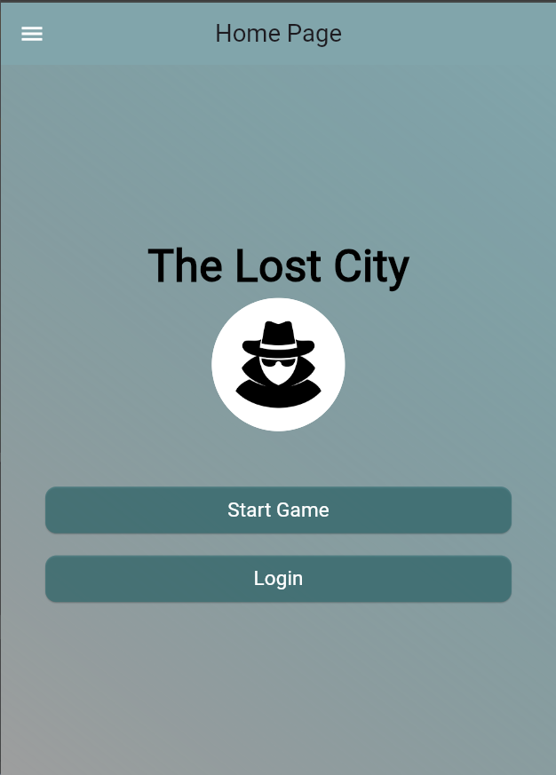
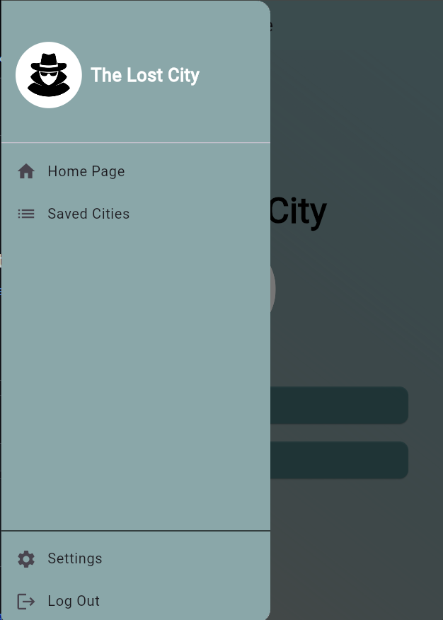
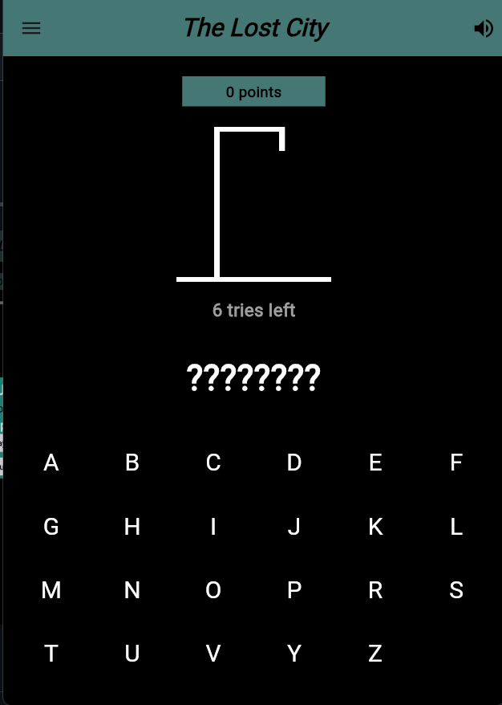
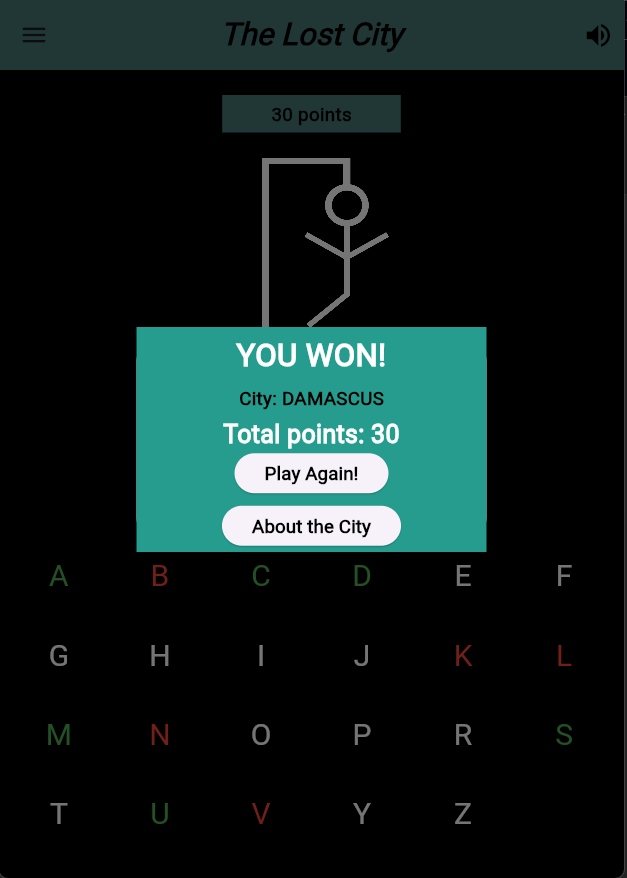
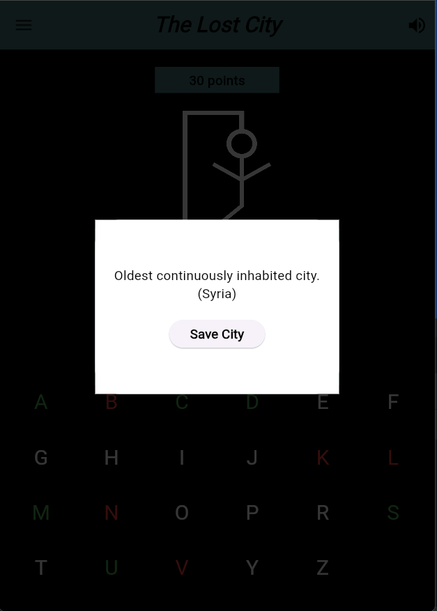

# The Lost City  
Interactive word-guessing game built with Flutter  

<div align="center">
  <div style="display: flex; justify-content: center; gap: 20px; flex-wrap: wrap;">
    
    
  </div>
</div>

---

## Core Features by Page

### 🏠 Home Page
- **Purpose:** Main navigation hub
- **Key Elements:**  
  - Start Game button (directs to Game Page)  
  - Login button (redirects to Login Page)  
  - Retro-style title animation  
  - Dynamic background gradient  

### 🎮 Game Page
- **Purpose:** City guessing mechanics
- **Key Elements:**  
  - Interactive letter grid (6x4 layout)  
  - Real-time attempt counter (6 attempts)  
  - Dynamic score tracker  
  - Context-sensitive sound effects  
  - Hidden city description reveal  

### 🔐 Login Page
- **Purpose:** User authentication
- **Key Elements:**  
  - Unique username validation  
  - In-memory credential storage  
  - Gradient background with floating particles  
  - Error handling for empty inputs  

### 📚 Saved Cities Page
- **Purpose:** Progress tracking
- **Key Elements:**  
  - Card-based city display  
  - Expandable description sections  
  - Auto-save on game victory  
  - Responsive list view  

---

<div align="center">
  <div style="display: flex; justify-content: center; gap: 20px; flex-wrap: wrap;">
    
    
    
  </div>
</div>

---

## Technical Implementation Details

### App Drawer Component
- **Dynamic Logo:** Fetched from MockAPI endpoint  
- **Navigation Items:**  
  - Home  
  - Saved Cities  
  - Settings (future implementation)  
- **State Management:** Provider pattern for menu toggle

### Game Logic Flow
1. Random city selection from 100+ entries  
2. Letter validation through hash maps  
3. Win condition: Full city name reveal  
4. Loss condition: 6 incorrect attempts  

---

## Technical Stack  
- **Framework:** Flutter 3.16 (Dart 3.0)  
- **Core Packages:**  
  - `audioplayers` for sound effects  
  - `http` for API integration  
  - `provider` for state management  
- **Data Sources:**  
  - 100+ cities across 6 continents  
  - MockAPI for dynamic configurations  
- **Architecture:** Layered (UI-Business-Data)  

### API Integration
- **Dynamic Logo:**  
  App Drawer logo is fetched from [MockAPI](https://mockapi.io) endpoint:  
  `GET https://67f0187d2a80b06b8896e4aa.mockapi.io/settings/1`  
  - Returns JSON with `logoUrl` field containing image URL  
  - Fallback to local asset if API fails

---

## Key Features  
### Game Mechanics  
- 6-attempt guessing system with live feedback  
- Dynamic scoring (+5 points per correct letter)  
- Color-coded letter status indicators  

### User Experience  
- Context-sensitive sound effects  
- One-tap audio toggle  
- API-driven dynamic logo  

### Data Management  
- **User Authentication:**  
  - Credentials stored in runtime memory using in-memory Map  
  - No persistent storage for security  
  - Unique username validation  
- City Collections:  
  - Save unlocked cities with descriptions  
  - Detailed city information cards  

---

## Development Team  
| Name                  | Responsibilities                                        |
|-----------------------|---------------------------------------------------------|
| Sumia Abiden          | App Drawer, Home Page, Game Logic and coding            |
| Mariam Kaibalieva     | API integration, Login Page, Game Logic and coding      |

---

## Unique Features  
1. **Educational Content**  
   Curated historical and cultural facts for each city.  

2. **Dynamic Customization**  
   - Theme-aware UI adjustments  
   - Location-based city suggestions  

3. **Progress Tracking**  
   - Real-time score updates  

---

## Installation  
1. **Prerequisites:**  
   - Flutter SDK 3.16+  
   - Android Studio or Xcode  

2. **Terminal Commands:**  
```bash
git clone https://github.com/SumiaAbiden/The_Lost_City.git
cd The_Lost_City
flutter pub get
flutter run
