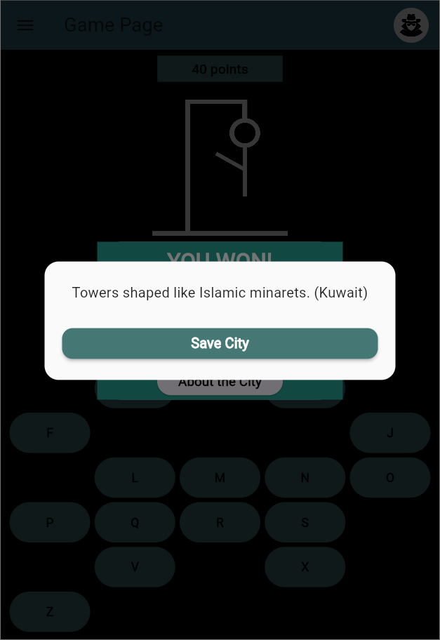

# The Lost City

**The Lost City** is an interactive hangman city-guessing game developed with Flutter. Players guess world cities letter by letter, just like in Hangman, and discover fun facts about them. The app offers a modern UI, dark mode, sound effects, secure user authentication, and score tracking using Firebase and Supabase.

---

## Features

- Letter-based city guessing game
- City and country facts after each round
- Firebase Authentication (Email, Google, GitHub)
- Supabase backend for storing scores and saved cities
- Light/Dark theme toggle and sound settings
- Clean and responsive UI with state management

---

## Test User

| Email                 | Password  |
|-----------------------|-----------|
| testuser@example.com  | Test1234  |

You can log in with this account to explore all features.

---

## Technologies

- Flutter
- Firebase Authentication
- Supabase (PostgreSQL)
- Provider (State Management)
- SharedPreferences (Local Settings)
- audioplayers (Sound Effects)

---

## Screenshots

### Home Page


---

### Login Page


---

### Profile Page


---

### Game Page


---

### Score Pop-up


---

### City Info Pop-up


---

### Saved Cities


---

## Installation

### Prerequisites

- Flutter SDK (v3.16 or higher)
- Android Studio or Xcode

### Setup

```bash
git clone https://github.com/SumiaAbiden/The_Lost_City.git
cd The_Lost_City
flutter pub get
flutter run
